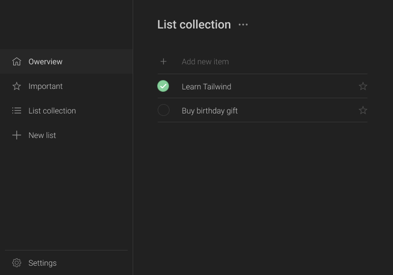
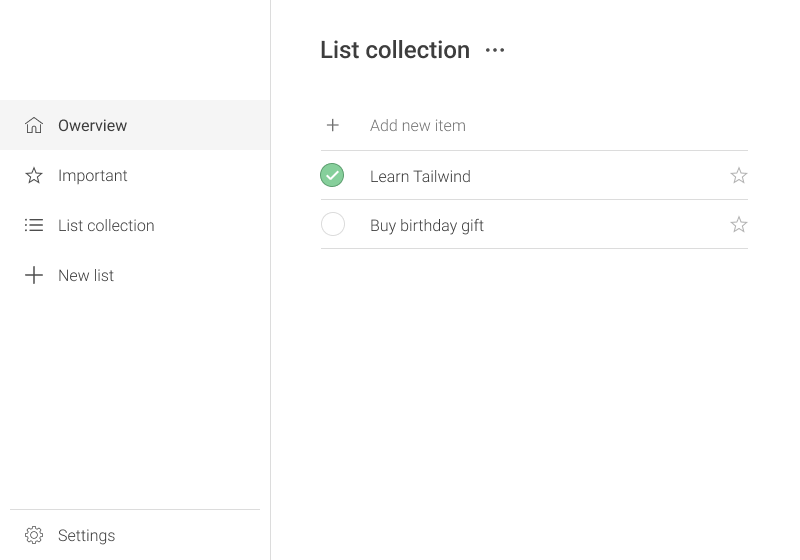

# React Task Manager

- 📚 Divide up your task to custom collections
- ⭐ Default Important tasks collection
- 🎨 Optional Dark and Light color schemes
- 🖌️ Customize your collections with Emojies

### Appearance

[🔗 Figma layout link](https://www.figma.com/file/4JNW8WzrUMZAeI3KopmENq/TODO-app?node-id=0%3A1)

### Collection customization with Emojies

### Technologies used

- React 
 	- React-Router-Dom
    - React-Icons
    - React-Transition-Group
    - Styled Components
- Electron
	- Electron-packager